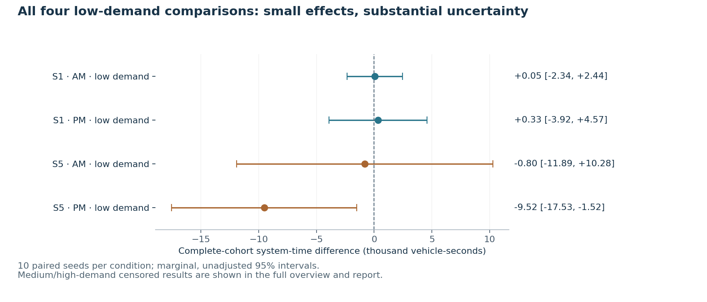

# Independent statistical findings

## Result

The study does not identify a policy that is reliably better across all tested conditions. S1 could not be statistically distinguished from the baseline in any condition using its marginal system-time interval. S5 has a small nominal improvement in low-demand PM, but it increases finite-window exposure in medium-demand AM. This is an uncalibrated synthetic-demand model study, not a field effectiveness guarantee.

## Completed design and integrity

- 96 exploration runs: eight families × AM/PM × three demand levels × two seeds (11, 29).
- 40 separate tuning evaluations: ten parameter configurations × AM/PM × two tuning seeds (41, 43), at medium demand.
- 180 independent verification runs: baseline, S1 and S5 × AM/PM × three demand levels × ten reserved seeds (101–110).
- Every declared run simulated 9900 s: 900 s warmup, 7200 s peak demand and 1800 s drain cap. These are 316 successful prespecified evaluations, excluding interrupted batches, smoke tests and benchmarks.
- No reported collisions, teleports, explicit failures or unexplained losses in these stages. Identical exogenous demand hashes were verified within each paired condition/seed.
- Independent trip-elapsed-time reconstruction agrees with all 316 evaluator TSTTs to within 2.5e−8 vehicle-seconds.
- The bounded tuning search found no nondefault setting satisfying the predeclared no-regression rule across all four tuning cases. Verification therefore used S1 green extension 8 s and S5 managed curb stop 8 s.


## Independent paired results

Each row contains ten paired seed replicates. Differences are candidate minus baseline. Negative finite-window exposure differences favor the candidate for that metric; they are not final trip-time improvements when any cohort remains unfinished. Intervals are marginal, fixed-sample, two-sided 95% Student t intervals. They are not adjusted for the twelve condition-policy comparisons and cannot establish an overall winner.

| Policy | Period | Demand scale | Mean Δ exposure (vehicle-s) | Marginal 95% CI | All paired cohorts complete? |
|---|---|---:|---:|---|---|
| S1 | AM | 0.6 | +47.4 | [-2,343.6, +2,438.4] | Yes |
| S1 | AM | 1.0 | -7,892.0 | [-254,823.8, +239,039.9] | No |
| S1 | AM | 1.4 | -90,277.9 | [-661,870.0, +481,314.2] | No |
| S1 | PM | 0.6 | +325.9 | [-3,921.0, +4,572.9] | Yes |
| S1 | PM | 1.0 | +26,382.8 | [-67,472.9, +120,238.5] | No |
| S1 | PM | 1.4 | +123,360.6 | [-232,781.5, +479,502.8] | No |
| S5 | AM | 0.6 | -803.7 | [-11,888.6, +10,281.3] | Yes |
| S5 | AM | 1.0 | +150,281.0 | [+10,596.9, +289,965.1] | No |
| S5 | AM | 1.4 | +412,006.9 | [-145,844.8, +969,858.6] | No |
| S5 | PM | 0.6 | -9,523.6 | [-17,530.6, -1,516.7] | Yes |
| S5 | PM | 1.0 | +29,239.6 | [-58,399.7, +116,878.8] | No |
| S5 | PM | 1.4 | -97,191.9 | [-504,829.8, +310,446.1] | No |

| Policy | Period | Demand scale | Mean Δ completion (percentage points) | Marginal 95% CI (pp) | Mean Δ external waiting (vehicles) |
|---|---|---:|---:|---|---:|
| S1 | AM | 0.6 | +0.000 | [+0.000, +0.000] | +0.0 |
| S1 | AM | 1.0 | -0.140 | [-0.827, +0.547] | -5.5 |
| S1 | AM | 1.4 | +0.309 | [-3.478, +4.096] | +32.5 |
| S1 | PM | 0.6 | +0.000 | [+0.000, +0.000] | +0.0 |
| S1 | PM | 1.0 | -0.003 | [-0.178, +0.172] | +3.0 |
| S1 | PM | 1.4 | -0.424 | [-5.659, +4.812] | -7.5 |
| S5 | AM | 0.6 | +0.000 | [+0.000, +0.000] | +0.0 |
| S5 | AM | 1.0 | -0.134 | [-0.705, +0.436] | -5.0 |
| S5 | AM | 1.4 | -3.135 | [-6.791, +0.521] | +12.1 |
| S5 | PM | 0.6 | +0.000 | [+0.000, +0.000] | +0.0 |
| S5 | PM | 1.0 | +0.065 | [-0.066, +0.196] | -0.1 |
| S5 | PM | 1.4 | +1.177 | [-2.814, +5.169] | -0.9 |



## Interpretation and side effects

S5 low-demand PM reduces complete-cohort system time by 9523.65 vehicle-seconds per replicate on average (marginal 95% CI −17530.63 to −1516.67). The mean of paired percentage changes is approximately −1.07%. This single nominal finding is not multiplicity-controlled and is insufficient for a general recommendation.

S5 medium-demand AM increases accumulated exposure by 150281 vehicle-seconds (marginal 95% CI +10596.93 to +289965.07). Because this comparison contains censored runs, it is evidence of worse observed-window exposure, not an estimate of eventual full-trip time. Its completion-rate interval still spans zero.

All medium/high comparisons contain at least one censored replicate. Completed-only means and P95 times were not used for ranking. None of the candidate policies achieves the implemented strict observed completion/backlog dominance criterion across every paired replicate in those conditions.

Exploration also exposes important limits: S2 lane reallocation causes substantial completion/backlog deterioration in these boundary-demand scenarios; it does not prove that real bus-lane policies are generally harmful. S3 has different AM and PM effects, including an AM-high case with lower finite-window exposure but worse completion. S4 is a genuine permission patch with zero tested route exposure: none of the 57214 baseline reference trips including warmup uses the restricted link, and all twelve S4 outputs equal baseline. This is not evidence of neighborhood benefit.

Car and bus vehicle subgroup metrics are exported separately. No passenger weights, full-person door-to-door effects, accident-rate reductions, long-term induced demand or mode shifts are inferred.

## Measured execution, not a GPU claim

- Exploration: 96 runs, 2 workers, observed stage elapsed 51.34 minutes (includes scheduling/initialization).
- Tuning: 40 runs, 4 workers, observed stage elapsed 7.53 minutes (includes scheduling/initialization).
- Verification: 180 runs, 4 workers, observed stage elapsed 53.69 minutes (includes scheduling/initialization).

These are measurements from the cloud execution environment, not promised throughput on another machine. Full four-output-mode and 1/2/4/8-worker benchmarking remains pending. The representative memory record is in `evidence/worker_memory_benchmark.json`; no CUDA/GPU speed claim is made.

## Outstanding validation

Field calibration, independent observed-traffic validation, pedestrian/nonmotorized behavior, E1 internal activity, expanded-boundary demand reconstruction and broader robustness remain pending. The .25 s smoke test fixes decision intervals but SUMO can automatically change to ballistic integration. A matched explicitly fixed-integrator numerical study is needed before claiming pure step-size robustness; see `evidence/integrator_probe.json` and `methods_and_assumptions.md`.

## Evidence and reproduction

- `evidence/study.json` and `.md`: complete 276-run exploration/verification paired report; tuning is separately budgeted.
- `evidence/verification.json` and `.svg`: the twelve independent condition-policy comparisons.
- `evidence/exploration_runs.json`, `optimization_runs.json`, `verification_runs.json`: actual configurations, identities, engine versions, metrics, audits and timings.
- Corresponding `*_execution.json`, `*_independent_check.json` and `*_subgroups.json`: completion ledger, independent numerical checks and car/bus subgroup metrics.
- `evidence/candidate_selection.json`, `optimization_plan.json`, `optimization_results.json`, `verification_plan.json`: selection and disjoint-seed records.

```sh
python scripts/report_results.py --runs var/formal-exploration-v2/runs var/formal-verification-v1/runs --plan docs/evidence/verification_plan.json --output docs/evidence/study.json
python scripts/export_evidence.py --state var/formal-verification-v1 --phase verification --label verification
```

## Additional bounded robustness study

A separate [24-run downstream-receiving sensitivity study](robustness_findings.md) brings the completed evaluation total to 340. It uses fresh seeds and frozen S0/S1/S5 policies, with paired nominal and hypothetical constrained receiving conditions. It remains exploratory and is not pooled into the 180 independent verification runs. It does not establish a robust winner. E1 internal activity, expanded-boundary reconstruction, independent curb/navigation variation, matched fixed-integrator sensitivity, and field calibration remain pending.
